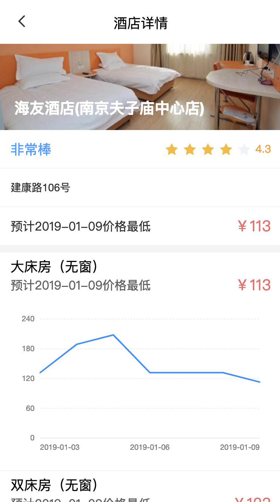

# sleeped-front-end
## 介绍
本项目服务于东南大学2018-2019-2学期大数据应用课程，提供一个相对美观的界面（界面设计参考了element-ui)
<div>



</div>
### 核心功能
功能1：对单个酒店价格进行预测，用户输入某一家酒店的名称和想要预测的时间段，生成该端时间内酒店价格曲线，给出预订建议。
功能2：对一批酒店价格进行预测，用户输入地点想要预测的时间段，借助第三方地图服务搜索周边酒店，生成该时间段内酒店价格曲线，给出预订建议。

## 开发
### 开发依赖
本项目通过vue-cli3建立，使用了vue-router，stylus额外安装了以下内容
- element-ui
- pug

### Project setup
```
yarn install
```

### Compiles and hot-reloads for development
```
yarn run serve
```

### Compiles and minifies for production
```
yarn run build
```

